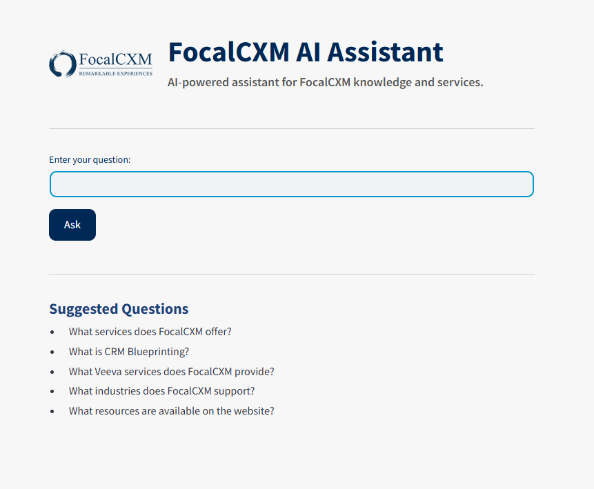
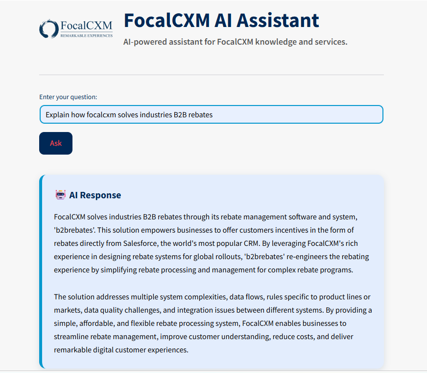

# 🤖 FocalCXM AI Assistant

An AI-powered enterprise assistant built using **Retrieval-Augmented Generation (RAG)** that answers questions about **FocalCXM** using information retrieved from the company's public website.

The assistant combines semantic search with a Large Language Model (LLM) to provide accurate, contextual, and organization-specific responses instead of relying solely on general model knowledge.

---

## 📌 Project Overview

Traditional Large Language Models (LLMs) often generate generic or outdated responses when asked about organization-specific information.

This project addresses that challenge by implementing a **Retrieval-Augmented Generation (RAG)** pipeline that:

- Scrapes public website content
- Converts content into vector embeddings
- Stores embeddings in a FAISS vector database
- Retrieves the most relevant context for a user's question
- Uses a Groq LLM to generate grounded, contextual responses

---

## 🚀 Features

- 🌐 Website Knowledge Ingestion
- ✂️ Intelligent Text Chunking
- 🧠 HuggingFace Embeddings
- 🔍 Semantic Search using FAISS
- 🤖 Context-Aware AI Responses
- ⚡ Groq LLM Integration
- 🎨 Custom FocalCXM Branded UI
- 📱 Responsive Streamlit Interface

---

# 🏗️ Architecture

```
                 FocalCXM Website
                        │
                        ▼
                Website Scraping
                        │
                        ▼
                 Text Preprocessing
                        │
                        ▼
                  Text Chunking
                        │
                        ▼
            HuggingFace Embeddings
                        │
                        ▼
              FAISS Vector Database
                        │
                        ▼
                  User Question
                        │
                        ▼
               Semantic Retrieval
                        │
                        ▼
                Retrieved Context
                        │
                        ▼
                   Groq LLM
                        │
                        ▼
                 AI Generated Answer
                        │
                        ▼
                 Streamlit Interface
```

---

# 🛠️ Technology Stack

## Frontend

- Streamlit
- Custom FocalCXM Branding
- Responsive UI

## Data Processing

- Requests
- BeautifulSoup
- Text Chunking

## Embeddings & Retrieval

- HuggingFace Embeddings
- FAISS Vector Database
- Semantic Search

## LLM & Generation

- Groq LLM
- Retrieval-Augmented Generation (RAG)
- Context-Aware Response Generation

## Frameworks

- LangChain
- Python

---

# 📂 Project Structure

```
focalcxm-ai-assistant/
│
├── assets/
│   ├── FocalCXMLogo.png
│   └── FocalCXMLogo1.png
│
├── utils/
│   ├── __init__.py
│   └── scraper.py
│
├── app.py
├── config.py
├── ingest.py
├── rag_pipeline.py
├── requirements.txt
├── .gitignore
└── README.md
```

---

# ⚙️ Installation

## Clone Repository

```bash
git clone https://github.com/CodeByKhushal/focalcxm-ai-assistant.git

cd focalcxm-ai-assistant
```

## Create Virtual Environment

```bash
python -m venv venv
```

Windows

```bash
venv\Scripts\activate
```

Mac/Linux

```bash
source venv/bin/activate
```

---

## Install Dependencies

```bash
pip install -r requirements.txt
```

---

## Create Environment File

Create a `.env` file.

```env
GROQ_API_KEY=your_api_key_here
```

---

## Build Vector Store

```bash
python ingest.py
```

---

## Run Application

```bash
streamlit run app.py
```

---

# 💬 Sample Questions

- What services does FocalCXM offer?
- What is CRM Blueprinting?
- What Veeva services does FocalCXM provide?
- What industries does FocalCXM support?
- What resources are available on the website?

---

# 📸 Screenshots

### 🏠 Home Page

The FocalCXM AI Assistant homepage featuring a clean, branded interface where users can ask natural language questions about FocalCXM's services, solutions, and expertise.



---

### 🤖 AI Response

Example of the AI Assistant retrieving relevant website context through the RAG pipeline and generating an accurate, context-aware response to a user query.


---

# 🎯 Future Enhancements

- Multi-website knowledge ingestion
- PDF document support
- Hybrid Search (Keyword + Semantic)
- Source citations in responses
- Conversation memory
- Authentication
- Docker deployment
- Cloud deployment
- Admin dashboard
- Analytics and monitoring

---

# 📚 Learning Outcomes

This project helped strengthen practical understanding of:

- Retrieval-Augmented Generation (RAG)
- Semantic Search
- Vector Databases
- Embedding Models
- Prompt Engineering
- LangChain
- Groq LLM Integration
- Streamlit Application Development
- Enterprise AI Architecture

---

# 👨‍💻 Author

**Khushal Kurhade**

AI Intern @ FocalCXM

LinkedIn: https://www.linkedin.com/in/khushal-kurhade

GitHub: https://github.com/CodeByKhushal

---

## ⭐ If you found this project interesting, consider giving it a Star!